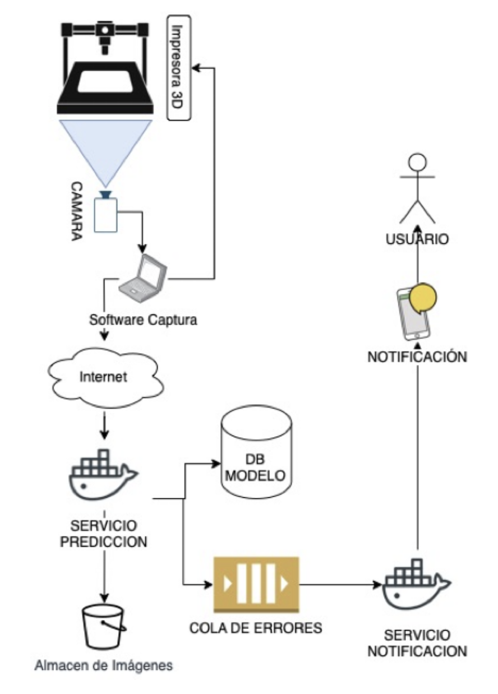

# 3D Printer Monitor

## Introduction

## Architecture

The following diagram is an example architecture described in this software. All the services (except the capturing software) is dockerized.

You should be able to run all the services independently of each other, nevertheless they share the same ./media/ directory, so be careful with that.

